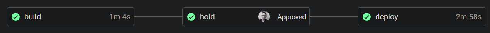
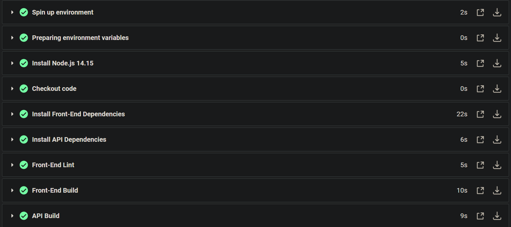
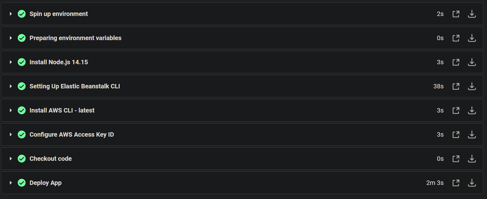
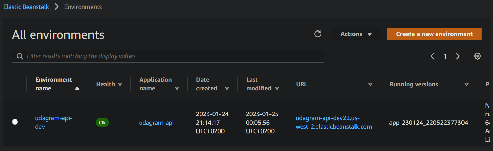
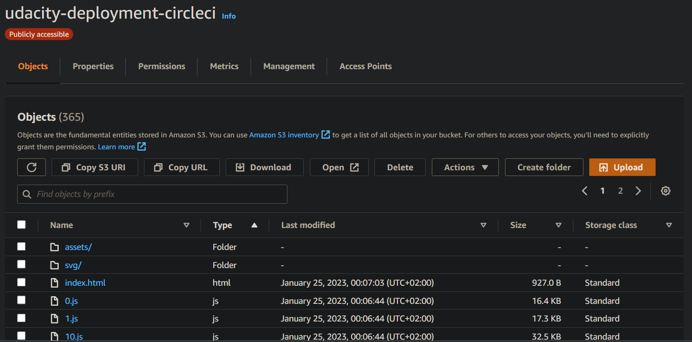

# Hosting a Full-Stack Application

## Built With

- [Angular](https://angular.io/) - Single Page Application Framework
- [Node](https://nodejs.org) - Javascript Runtime
- [Express](https://expressjs.com/) - Javascript API Framework

## License

[License](LICENSE.txt)

## Overview

The project application, **Udagram** - an image iltering application, allows users to register and log into a web client, post photos to the feed, and process photos using an image filtering service. It has two components:

1. Frontend - Angular web application built with Ionic framework
2. Backend RESTful API - Node-Typescript application

Udagram starter application has been provided by the Udacity team. I worked on deploying this application and setting up a CD/CI pipeline on CircleCI.

* Frontend URL: [http://udacity-deployment-circleci.s3-website-us-west-2.amazonaws.com/](http://udacity-deployment-circleci.s3-website-us-west-2.amazonaws.com/)
* Backend URL:  [http://udagram-api-dev22.us-west-2.elasticbeanstalk.com/](http://udagram-api-dev22.us-west-2.elasticbeanstalk.com/)

## Screenshots

* Last successful CircleCi build:

* Build:

* Deploy:

* AWS RDS: Database Server

* AWS ElasticBeanstalk: API Deployment

* AWS S3: Frontend

