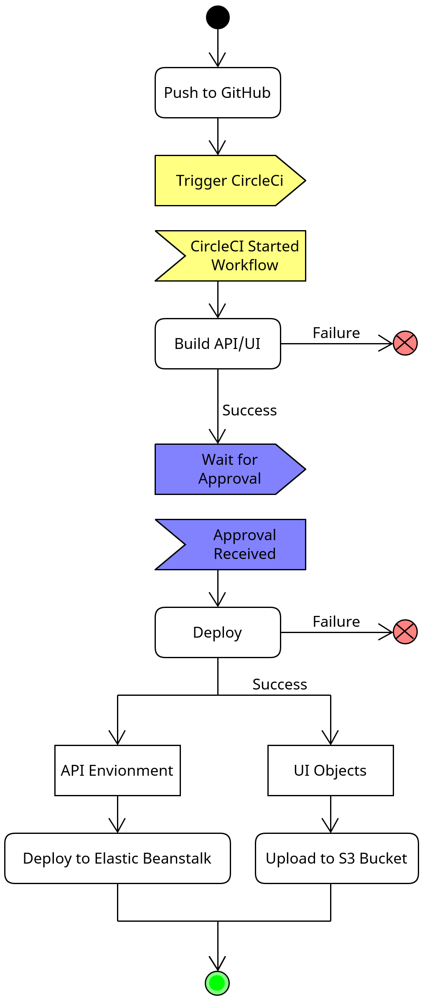

# Pipeline Description

1. Install node and checkout code
2. Install dependencies for the frontend app
3. Install dependencies for the backend app
4. Build Front-End app
5. Build API app
6. Deploy API to Elastic Beanstalk
7. Deploy UI to S3

